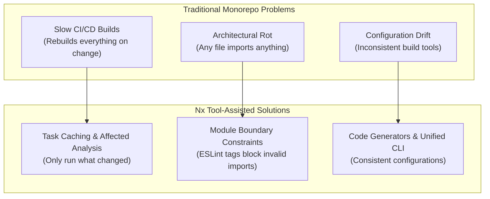
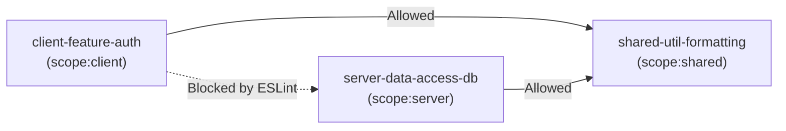
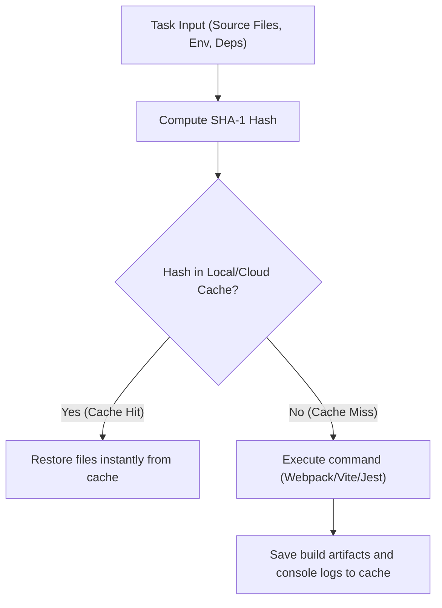

# 📁 Lesson 1: Nx Monorepo Guide (Architecture & Theory)

This lesson explores the core architectural patterns of monorepos managed by Nx. You will learn the difference between colocating code and using modern tooling, how to structure applications and libraries, and how to enforce dependency boundaries.

---

## 🗺️ Table of Contents
*   [Section 1: Introduction to NX Monorepos](#section-1-introduction-to-nx-monorepos)
*   [Section 2: Workspace Architecture](#section-2-workspace-architecture)
*   [Section 3: Library Types and Organization](#section-3-library-types-and-organization)
*   [Section 4: Feature Module Pattern](#section-4-feature-module-pattern)
*   [Section 5: Module Boundaries and Dependencies](#section-5-module-boundaries-and-dependencies)
*   [Section 6: Build and Development Workflow](#section-6-build-and-development-workflow)
*   [Section 7: Summary & Best Practices](#section-7-summary--best-practices)

---

## Section 1: Introduction to NX Monorepos

When managing multiple projects, software teams face a fundamental repository layout decision:

```
📁 POLYREPO STRATEGY (Independent Repositories)
├── web-app-repo [Vite/React]
├── mobile-app-repo [React Native]
├── api-server-repo [Node/Express]
└── shared-types-repo [npm package]

📦 MONOREPO STRATEGY (Unified Codebase)
└── monorepo/
    ├── apps/
    │   ├── web-app/
    │   └── api-server/
    └── libs/
        └── shared/
```

### 1. Architectural Comparison: Polyrepo vs. Monorepo
| Architectural Aspect | Polyrepo | Monorepo |
| :--- | :--- | :--- |
| **Code Sharing** | Must publish packages to npm registry, manage semver, install updates. | Direct relative imports, compile-time checks, instant updates. |
| **Cross-Project Changes**| Requires multiple pull requests coordinated across different repositories. | Single atomic commit updating both client and server APIs. |
| **Dependency Management**| Repositories drift; each uses different versions of react, lodash, eslint. | Single `package.json` at root; single version policy across apps. |
| **Refactoring** | Extremely complex; hard to find breaking changes across codebases. | IDE-supported refactoring across apps and libraries instantly. |

### 2. The Colocation Trap & How Nx Solves It
Simply placing all code inside one repository (code colocation) without proper tooling is dangerous. It leads to slow CI builds, tangled dependencies, and configuration drift. Nx provides tool-assisted monorepos to solve these challenges:



---

## Section 2: Workspace Architecture

Nx recommends the **"Thin Apps" Philosophy**: Keep applications as thin, deployable wrappers, and move the bulk of the logic into modular libraries.

### 1. Concrete Workspace Anatomy
Below is a typical production-grade directory structure:

```
monorepo/
├── apps/                    # Thin, deployable entry points (Shells)
│   ├── web-app/             # Next.js or Vite React App (Only contains bootstrap, routing, root layout)
│   └── api-server/          # Node.js Express/Hono API (Only registers routes and starts middleware)
│
├── libs/                    # Core codebase (Modular libraries)
│   ├── client/              # Frontend-specific modules
│   │   ├── feature-auth/    # Authentication pages, components, & hooks
│   │   └── feature-profile/ # Profile settings components
│   ├── server/              # Backend-specific modules
│   │   └── data-access-db/  # Database schema (Prisma/Drizzle) & queries
│   └── shared/              # Reusable modules for both client and server
│       ├── ui-components/   # Design system (Buttons, inputs, modals)
│       └── util-formatting/ # Formatting helpers (Dates, currency)
│
├── nx.json                  # Nx pipeline & cache configurations
├── tsconfig.base.json       # Path aliases mapping libraries to imports
└── package.json             # Workspace dependencies
```

### 2. apps/ vs libs/ Separation of Concerns
*   **Applications (`apps/`)**: Build artifacts (creates bundles, Dockerfiles, deployments). Keeps configuration, environment variables setup, and page orchestration.
*   **Libraries (`libs/`)**: Pure source code. Consumed by apps at build time. Cannot be deployed independently, but can be tested, linted, and built in isolation.

---

## Section 3: Library Types and Organization

Nx categorizes libraries by purpose to avoid circular dependencies and make the codebase highly scannable:

```
                ┌───────────────────────────────────┐
                │        Applications (apps/)       │
                └─────────────────┬─────────────────┘
                                  │ (Imports)
                                  ▼
                ┌───────────────────────────────────┐
                │         Feature Libraries         │
                └─────────────────┬─────────────────┘
                                  │ (Imports)
                                  ▼
                ┌───────────────────────────────────┐
                │    UI & Data-Access Libraries     │
                └─────────────────┬─────────────────┘
                                  │ (Imports)
                                  ▼
                ┌───────────────────────────────────┐
                │         Utility Libraries         │
                └───────────────────────────────────┘
```

1.  **Feature Libraries**: Smart components, pages, forms, and business logic. Connected to data access hooks.
2.  **UI Libraries**: Presentational, stateless "dumb" components. Receive data through `props`, communicate events through callbacks (e.g. UI Buttons, Modals).
3.  **Data-Access Libraries**: API integration layers, state management stores (Zustand, TanStack Query), database queries (Prisma/Drizzle).
4.  **Utility Libraries**: Helper functions, formatters, type definitions, and constant values.

---

## Section 4: Feature Module Pattern

The Feature Module Pattern encapsulates everything related to a single business domain into a self-contained library folder with an explicit public API boundary.

### 1. Directory Structure of a Feature Library
```
libs/client/feature-auth/
├── src/
│   ├── index.ts              # Public API (Barrel Export)
│   ├── signin/
│   │   ├── signin-form.tsx   # React UI Component
│   │   └── use-signin.ts     # Form logic & state custom hook
│   └── auth-provider.tsx     # Session state React Context Provider
└── project.json              # Library target settings
```

### 2. Public API Enforcement
The `src/index.ts` file acts as a gatekeeper. Consumers can only import what is explicitly exported from this file:

```typescript
// libs/client/feature-auth/src/index.ts

// Explicitly export public components
export { SigninForm } from './signin/signin-form';
export { AuthProvider, useAuth } from './auth-provider';

// Internal files (like use-signin.ts) remain private to the library
```

Importing from another application or library:
```typescript
// ✅ Good: Clean public API import
import { SigninForm } from '@org/client-feature-auth';

// ❌ Bad: Importing internal files directly. Causes compiler warnings.
import { useSignin } from '@org/client-feature-auth/src/signin/use-signin';
```

---

## Section 5: Module Boundaries and Dependencies

To prevent security leaks (e.g. importing database secrets into client-side JS) and circular imports, Nx uses tags to enforce strict architectural constraints.

### 1. Tagging Projects
Tags are defined in each library's `project.json` file:

```json
// libs/client/feature-auth/project.json
{
  "name": "client-feature-auth",
  "tags": ["scope:client", "type:feature"]
}

// libs/server/data-access-db/project.json
{
  "name": "server-data-access-db",
  "tags": ["scope:server", "type:data-access"]
}
```

### 2. Constraint Resolution Flow
The boundary rules are enforced at development time via ESLint:



---

## Section 6: Build and Development Workflow

Nx provides a powerful command runtime to execute tasks efficiently.



*   **Cache Hits**: Sparing your computer from compiling unmodified modules. If you build a project, then build it again without changing files, the second run completes in milliseconds.
*   **Affected Computations**: Sparing CI servers from testing the whole codebase on tiny code changes.
    ```bash
    nx affected -t lint test build --base=main --head=HEAD
    ```

---

## Section 7: Summary & Best Practices

1.  **Strict Boundaries**: Tag every new app and library with a defined scope (`scope:client`, `scope:server`, `scope:shared`) and type (`type:feature`, `type:ui`, `type:data-access`, `type:util`).
2.  **No Direct Inner Imports**: Never import code bypassing the `src/index.ts` barrel file.
3.  **Optimize namedInputs**: Keep test files (`*.spec.ts`, `*.test.ts`) excluded from production cache hashes in `nx.json` so changing a unit test doesn't invalidate your production build cache.
