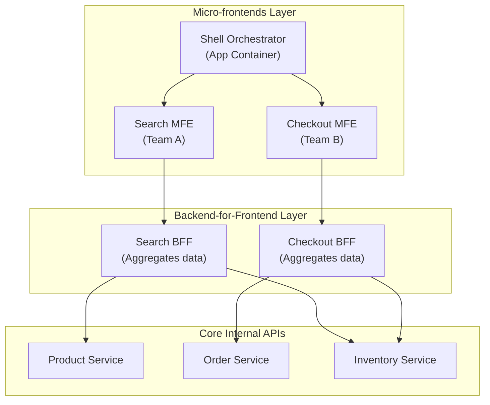

# ⚛️ Lesson 4: React Frontend Architecture (Decoupled vs. Integrated)

This lesson provides guidelines on choosing the right React architectural layout for your project size, team structure, and business constraints. We compare decoupled SPAs, integrated Full-stack frameworks, and enterprise Micro-frontends.

---

## 🗺️ Table of Contents
*   [Section 1: The Tech Stack Trap](#section-1-the-tech-stack-trap)
*   [Section 2: SPA and API Server](#section-2-spa-and-api-server)
*   [Section 3: Full-stack Frameworks](#section-3-full-stack-frameworks)
*   [Section 4: Micro-frontends and BFFs](#section-4-micro-frontends-and-bffs)
*   [Section 5: Product-Minded Architecture](#section-5-product-minded-architecture)

---

## Section 1: The Tech Stack Trap

Many developers fall into the trap of adopting complex architectures simply because they are trendy.
*   **The AI Bias**: If you ask an AI assistant for a React setup, it defaults to Next.js because Next.js has the most tutorials on the web.
*   **The Comment Thread Trap**: Spending hours debating frameworks in Reddit threads is a waste of time. Focus on your specific product constraints instead of following tech influencers.

---

## Section 2: SPA and API Server

The traditional decoupled architecture splits the frontend (static React build on CDN) and the backend (API Server running Go, Node, or Python) entirely.

```
┌─────────────────┐       GET index.html       ┌──────────────┐
│  User Browser   │ ─────────────────────────► │   CDN Edge   │
│                 │ ◄───────────────────────── │ (Static S3)  │
└────────┬────────┘      HTML/JS/CSS Files     └──────────────┘
         │
         │  JSON/GraphQL requests
         ▼
┌─────────────────┐
│   API Server    │ ──► [Reads/Writes] ──► [Database]
│ (Go/Node/Hono)  │
└─────────────────┘
```

### 1. Architectural Trade-offs
*   **Pros**:
    *   **Simplicity**: Clear separation of concerns. Frontend runs in browser; backend runs on server. No hydration mismatches.
    *   **Hassle-Free Deployment**: Frontend deploys to storage buckets (S3, Cloudflare Pages) costing pennies.
    *   **Technology Freedom**: Backend can be built in any language (Go, Python, Rust) without coupling to Node.js.
*   **Cons**:
    *   **No Native SEO**: Crawler receives an empty HTML shell.
    *   **Double Deployments**: Must manage separate CI/CD pipelines for client and server.

### 2. Recommended Decoupled Stack
*   **Frontend**: Vite + React Router + TanStack Query + Tailwind CSS.
*   **Backend**: Hono (Node/Bun/Cloudflare Workers) or Express/Fastify.
*   **Database**: PostgreSQL (Neon, Supabase) with Prisma or Drizzle ORM.
*   **Monorepo**: Nx to coordinate types and validation schemas across client and server.

---

## Section 3: Full-stack Frameworks

Integrated frameworks (Next.js, Remix, TanStack Start) manage the boundary between client and server, providing unified routing, data loaders, and server rendering.

### 1. Architectural Trade-offs
*   **Pros**:
    *   **Integrated Tooling**: File-based routing, automatic code splitting, and image optimization out of the box.
    *   **Optimal SEO**: Server-side rendering supplies crawlers with fully populated HTML.
    *   **Single Deployment**: Unified repository, deploy target, and CI configuration.
*   **Cons**:
    *   **Node.js Locked**: Backend logic is coupled to Node.js / V8 environments.
    *   **Higher Complexity Ceiling**: Developers must navigate hydration boundaries and compiler directives (`'use client'`, `'use server'`).

---

## Section 4: Micro-frontends and BFFs

For organizations with hundreds of developers, a single monolith repository causes deployment blockages. Micro-frontends (MFE) split the UI into separate apps compiled independently and loaded into a single Shell.



### 1. The BFF Role (Backend-For-Frontend)
Rather than making client-side MFEs fetch from multiple internal microservices, each MFE is assigned a dedicated backend service (BFF). The BFF aggregates downstream API data and returns a clean, optimized payload specifically tailored to its frontend counterpart.

### 2. Architectural Trade-offs
*   **Pros**: Complete team autonomy, independent deployment cycles, and minimized blast radius (a crash in Search MFE doesn't block checkout).
*   **Cons**: Massive infrastructure overhead (Kubernetes, Module Federation configurations, OAuth gateways) and potential UX inconsistencies.

---

## Section 5: Product-Minded Architecture

Use this assessment matrix to select your architecture:

```
                          SPA + API
                        Solo Dev Fit
                             10
                              ⎹
                              8
                              ⎹
        Deploy Simplicity  6 ─── 4  SEO & Public Content
                            / ╲ / ╲
                           4   X   6
                          /   / ╲   ╲
                         2   /   ╲   8
                        /   /     ╲   ╲
  Cost Efficiency      0 ─── 0 ──── 0 ─── 10  Enterprise Scale
                       ╲   /       ╲   /
                        2 /         ╲ /
                         4           8
                          ╲         /
                           6       6
                            ╲     /
                             8   4
                              ╲ /
                              10
                         Developer Exp
```

*   **Choose SPA + API**: If your app is auth-gated (SaaS dashboards, internal database monitors).
*   **Choose Full-stack (Next.js/Remix)**: If your app has public marketing routes, e-commerce lists, or content catalog directories where SEO is critical.
*   **Choose Micro-frontends**: Only when your engineering organization scales past 30+ developers and team autonomy outweighs infrastructure complexity.
