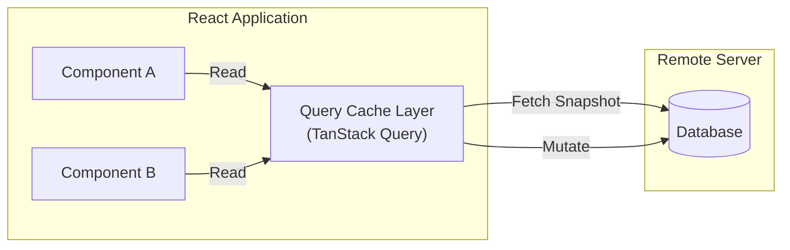

# 🧠 Lesson 5: Client vs Server State Separation (Query, Zustand, URL)

This lesson explores how to manage data flow in React applications. You will learn the difference between Client State and Server State, why using a global store for API responses is an anti-pattern, and how to write clean caching and state configurations.

---

## 🗺️ Table of Contents
*   [Section 1: When "State" Was Just One Word](#section-1-when-state-was-just-one-word)
*   [Section 2: The Server State](#section-2-the-server-state)
*   [Section 3: Server State in Practice (TanStack Query)](#section-3-server-state-in-practice-tanstack-query)
*   [Section 4: The Client State](#section-4-the-client-state)
*   [Section 5: Client State in Practice (Zustand & URL)](#section-5-client-state-in-practice-zustand--url)
*   [Section 6: Choosing Between Libraries](#section-6-choosing-between-libraries)

---

## Section 1: When "State" Was Just One Word

In early Redux implementations, developers stored *everything* inside a single global store. 

```
❌ THE REDUX MONOLITH STORE
state/
├── users/ (API Response Cache)
├── products/ (API Response Cache)
├── theme/ (UI Settings)
├── isSidebarOpen/ (UI Settings)
└── signupForm/ (Temporary Form Draft)
```

This single-store pattern led to several problems:
*   **Boilerplate Bloat**: Writing action types, actions, thunks, and reducers for simple API requests.
*   **In-Memory Cache Drift**: Navigating away from a page and back refetched the API, or required manual cache cleanup logic.
*   **Re-Render Chains**: Typing in a temporary input field updated the global store, triggering re-renders across static data tables.

---

## Section 2: The Server State

Server State is data that lives in a remote database and is not owned by the frontend client. The client only displays a temporary snapshot of it.



### The Caching Lifecycle:
1.  **Fetch**: Initiate an async network request.
2.  **Cache**: Store the response under a unique `queryKey`.
3.  **Serve**: Provide cached data immediately to components.
4.  **Revalidate**: Fetch in the background when the page is refocused.
5.  **Mutate**: Send updates to the database.
6.  **Invalidate**: Mark cached keys as stale, triggering automatic refetches.

---

## Section 3: Server State in Practice (TanStack Query)

### 1. Unified Query Client Configuration
Initialize the client at the root of your application with safe defaults:
```typescript
import { QueryClient } from '@tanstack/react-query';

export const queryClient = new QueryClient({
  defaultOptions: {
    queries: {
      staleTime: 60 * 1000,      // Data is considered fresh for 1 minute
      gcTime: 5 * 60 * 1000,     // Garbage collect unused queries after 5 minutes
      refetchOnWindowFocus: true,// Auto-refresh stale data on tab focus
      retry: 1                   // Retry failed requests once before showing error
    }
  }
});
```

### 2. Implementing Optimistic Updates
Optimistic updates update the UI immediately to make interactions feel instant (~50ms) before the server confirms the request:

```typescript
import { useMutation, useQueryClient } from '@tanstack/react-query';

interface User {
  id: string;
  name: string;
  role: string;
}

export function useUpdateUserRole() {
  const queryClient = useQueryClient();

  return useMutation({
    mutationFn: async ({ id, role }: { id: string; role: string }) => {
      const res = await fetch(`/api/users/${id}/role`, {
        method: 'POST',
        headers: { 'Content-Type': 'application/json' },
        body: JSON.stringify({ role })
      });
      return res.json();
    },
    
    // Triggered when mutate() is called
    onMutate: async ({ id, role }) => {
      // 1. Cancel in-flight refetches for the users list
      await queryClient.cancelQueries({ queryKey: ['users'] });

      // 2. Snapshot the current cache value
      const previousUsers = queryClient.getQueryData<User[]>(['users']);

      // 3. Optimistically update the cache list
      queryClient.setQueryData<User[]>(['users'], (old) =>
        old?.map((user) => (user.id === id ? { ...user, role } : user))
      );

      // Return context containing snapshot for rollback
      return { previousUsers };
    },

    // Rollback to previous state on failure
    onError: (err, newVariables, context) => {
      if (context?.previousUsers) {
        queryClient.setQueryData(['users'], context.previousUsers);
      }
    },

    // Revalidate cache to sync with server reality
    onSettled: () => {
      queryClient.invalidateQueries({ queryKey: ['users'] });
    }
  });
}
```

---

## Section 4: The Client State

Client State is synchronous, local, device-specific UI state (e.g. sidebar toggle, modal visible).

### The Scoping Ladder:
```
1. useState (Local component)
    └── 2. Lift State (Pass props to siblings)
         └── 3. URL Query Params (For filters, page numbers)
              └── 4. Zustand Store (For global UI configurations)
                   └── 5. LocalStorage (For persistent device preferences)
```

---

## Section 5: Client State in Practice (Zustand & URL)

### 1. Zustand: Modular UI Store
Use Zustand to store global UI state. Always read state using selectors to prevent unnecessary component re-renders:

```typescript
import { create } from 'zustand';
import { persist } from 'zustand/middleware';

interface UIState {
  theme: 'light' | 'dark';
  sidebarCollapsed: boolean;
  setTheme: (theme: 'light' | 'dark') => void;
  toggleSidebar: () => void;
}

export const useUIStore = create<UIState>()(
  persist(
    (set) => ({
      theme: 'light',
      sidebarCollapsed: false,
      setTheme: (theme) => set({ theme }),
      toggleSidebar: () => set((state) => ({ sidebarCollapsed: !state.sidebarCollapsed }))
    }),
    { name: 'app-ui-settings' } // Saved in LocalStorage
  )
);
```

#### Consumption in Component:
```tsx
export function SidebarToggle() {
  // ✅ Good: Selector hooks ensure this component only re-renders when sidebarCollapsed changes
  const collapsed = useUIStore((state) => state.sidebarCollapsed);
  const toggle = useUIStore((state) => state.toggleSidebar);

  return (
    <button onClick={toggle}>
      {collapsed ? 'Expand' : 'Collapse'}
    </button>
  );
}
```

### 2. URL State with `nuqs`
If a filter or page state should survive page reloads or be shareable via a URL link, store it on the URL:

```tsx
import { useQueryState, parseAsInteger, parseAsString } from 'nuqs';

export function MemberListFilters() {
  // Syncs ?role=admin&page=2 to URL automatically
  const [role, setRole] = useQueryState('role', parseAsString.withDefault('all'));
  const [page, setPage] = useQueryState('page', parseAsInteger.withDefault(1));

  return (
    <div>
      <select value={role} onChange={(e) => setRole(e.target.value)}>
        <option value="all">All Roles</option>
        <option value="admin">Admin</option>
        <option value="member">Member</option>
      </select>
      <button onClick={() => setPage(page + 1)}>Next Page</button>
    </div>
  );
}
```

---

## Section 6: Choosing Between Libraries

| State Category | Library | Purpose |
| :--- | :--- | :--- |
| **Server State** | **TanStack Query** | Coordinates fetches, mutations, deduping, and client cache invalidations. |
| **Global Client State** | **Zustand** | Lightweight global store for UI flags and configurations. |
| **URL Client State** | **nuqs** | Synchronizes search/filter/pagination criteria directly with URL query parameters. |
| **Local State** | `useState` / `useReducer` | Keeps variables localized to individual components. |
