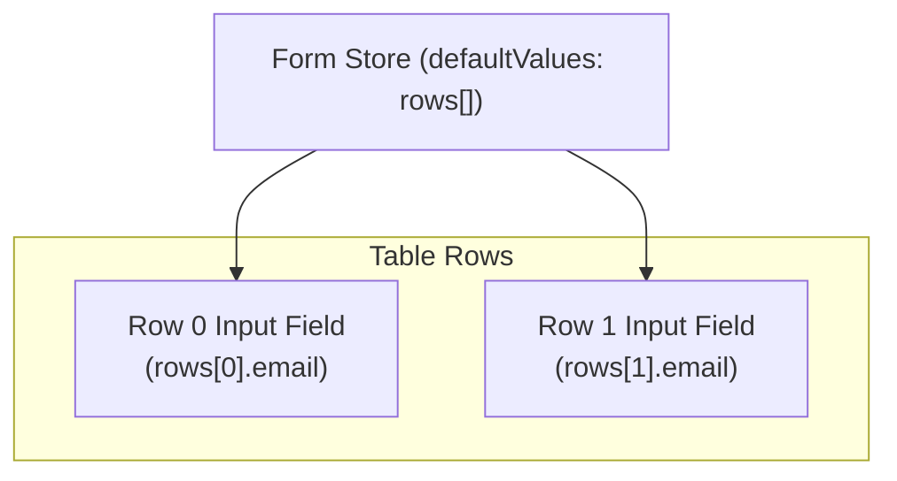

# ⚛️ Lesson 6: High-Performance React Forms (React 19 vs. TanStack Form)

This lesson explores form architecture in React. You will learn the difference between controlled and uncontrolled forms, when to use React 19 native form APIs, and how to scale to complex multi-step wizards or editable spreadsheets using TanStack Form and Zod validation schemas.

---

## 🗺️ Table of Contents
*   [Section 1: History and Mental Model of a Form](#section-1-history-and-mental-model-of-a-form)
*   [Section 2: Waitlist Signup Form (React 19 Native)](#section-2-waitlist-signup-form-react-19-native)
*   [Section 3: Job-application Wizard Form (TanStack Form + Zod)](#section-3-job-application-wizard-form-tanstack-form--zod)
*   [Section 4: Editable Team-roster Table (Field Arrays)](#section-4-editable-team-roster-table-field-arrays)
*   [Section 5: Summary & Tool Selection Rules](#section-5-summary--tool-selection-rules)

---

## Section 1: History and Mental Model of a Form

Regardless of the framework, every form is responsible for four core operations:
1.  **Capture**: Binding DOM input inputs to runtime state.
2.  **Verify**: Validating inputs against schemas (synchronously and asynchronously).
3.  **Recover**: Displaying validation warnings and letting users edit values.
4.  **Commit**: Executing the submission network payload.

### 1. Field Metadata States
*   **Value**: The raw string or object inside the input element.
*   **Touched**: True if the user clicked inside the field and tabbed out (`onBlur`). 
*   **Dirty**: True if the current value differs from the default value. 

> [!TIP]
> **Validation Rule**: Validate on every keystroke, but only display the error message *after* the field has been touched or a submit is attempted:
> `const showFieldError = (touched || submitted) && error;`

---

## Section 2: Waitlist Signup Form (React 19 Native)

For simple forms (e.g. newsletter signups, password resets), React 19 provides built-in Hooks to handle asynchronous actions without requiring heavy libraries.

```tsx
// app/waitlist-form.tsx
'use client'

import { useActionState } from 'react';
import { useFormStatus } from 'react-dom';
import { signupAction } from './actions';

export function WaitlistForm() {
  // useActionState manages the response from the server action
  const [state, formAction] = useActionState(signupAction, null);

  return (
    <form action={formAction} className="space-y-4">
      <div>
        <label htmlFor="email">Work Email</label>
        <input id="email" name="email" type="email" required className="border p-2" />
        {state?.error && <span className="text-red-500">{state.error}</span>}
      </div>
      <SubmitButton />
    </form>
  );
}

function SubmitButton() {
  // useFormStatus checks the pending state of the parent form
  const { pending } = useFormStatus();
  return (
    <button type="submit" disabled={pending} className="bg-blue-500 text-white p-2">
      {pending ? 'Submitting...' : 'Join Waitlist'}
    </button>
  );
}
```

---

## Section 3: Job-application Wizard Form (TanStack Form + Zod)

For multi-step wizards, using raw `useState` forces the entire page to re-render on every keystroke. **TanStack Form** resolves this by subscribing individual input controls to the form store.

### 1. Unified Zod Validation Schemas
Define step-level schemas and merge them into a single validation schema:
```typescript
import { z } from 'zod';

export const step1Schema = z.object({
  role: z.enum(['Frontend', 'Backend', 'Fullstack']),
  experience: z.number().min(0)
});

export const step2Schema = z.object({
  country: z.string().min(1),
  email: z.string().email('Please enter a valid email address')
});

export const jobApplicationSchema = z.object({
  ...step1Schema.shape,
  ...step2Schema.shape
});

export type JobApplication = z.infer<typeof jobApplicationSchema>;
```

### 2. Async Input Validation with `AbortSignal`
Use `AbortSignal` to prevent race conditions during asynchronous validation (e.g. checking if an email is already registered):

```tsx
// inside TanStack form Field component:
<form.Field
  name="email"
  asyncDebounceMs={500}
  validators={{
    onChangeAsync: async ({ value, signal }) => {
      try {
        // signal is passed to the fetch API; if the user keeps typing,
        // the previous pending request is aborted instantly
        const res = await fetch(`/api/check-email?email=${value}`, { signal });
        const data = await res.json();
        return data.taken ? 'Email already registered' : undefined;
      } catch (err) {
        if (err instanceof DOMException && err.name === 'AbortError') {
          return undefined; // Swallowed
        }
        return 'Validation failed';
      }
    }
  }}
>
  {(field) => (
    <div>
      <input
        value={field.state.value}
        onChange={(e) => field.handleChange(e.target.value)}
        onBlur={field.handleBlur}
      />
      {field.state.meta.isValidating && <span>Checking email...</span>}
      {field.state.meta.isTouched && field.state.meta.errors?.[0] && (
        <span className="text-red-500">{field.state.meta.errors[0]}</span>
      )}
    </div>
  )}
</form.Field>
```

---

## Section 4: Editable Team-roster Table (Field Arrays)

An editable data table (Field Array) allows users to dynamically push, remove, and validate multiple rows of inputs.



### 1. Key Implementations for Dynamic Lists
*   **Stable React Keys**: Always assign a unique ID (e.g. `uuid`) to each row at creation. Avoid using array `index` as keys. If you use array indices, deleting a row shifts the indexes, causing React to reuse the DOM of the deleted row for a different dataset.
*   **Whole-Array cross-field validation**:
    Use Zod `superRefine` to enforce rules across the entire array, such as requiring exactly one Admin role:
    ```typescript
    export const teamRosterSchema = z.object({
      rows: z.array(
        z.object({
          email: z.string().email(),
          role: z.enum(['Admin', 'Editor', 'Viewer'])
        })
      )
    }).superRefine((data, ctx) => {
      const adminCount = data.rows.filter(r => r.role === 'Admin').length;
      if (adminCount !== 1) {
        ctx.addIssue({
          code: 'custom',
          path: ['rows'],
          message: 'The roster must contain exactly one Admin.'
        });
      }
    });
    ```

---

## Section 5: Summary & Tool Selection Rules

*   **React 19 Native Forms**: Ideal for simple forms (newsletter subscription, login). It keeps code bundles small and works without additional JavaScript dependencies.
*   **TanStack Form + Zod**: Ideal for large, multi-step wizards, interactive tables, and dynamically generated layouts. It limits re-renders to modified fields, keeping typing responsive even in large forms.
