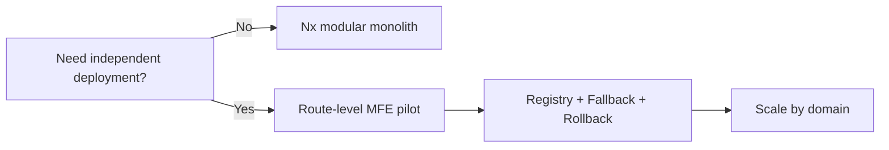

[Reference tutorial: Micro Front with Nx (Medium)](https://medium.com/@shubham1838/micro-front-with-nx-63b35c26c4d6)

# Micro Frontend + Nx Monorepo: Practical Architecture Guide

**Updated for Nx 23.1 (verified: 2026-07-23).** Nx is now the build system and orchestration layer for monorepos. For React, Nx 23 has changed the terminology from `host/remote` to `consumer/provider`. ([nx.dev][1])

## Quick Snapshot

- Start with an **Nx modular monolith** first; do not introduce Micro Frontends (MFE) too early.
- Only split into MFEs when you really need **independent deployment** across multiple teams.
- Focus on boundaries based on **route/domain**, rather than splitting small components.
- Share only must-have singleton dependencies (like `react` and `react-dom`).



> **Key Takeaway:**
> Start with an **Nx modular monolith** first. Only add Micro Frontends when **independent deployment is a real business or organizational requirement**, not just because your application has "a lot of code."

---

## 1. Most Valuable Insights

### 1. Micro Frontends solve organizational problems, not bundling problems

Micro Frontends are useful when multiple teams work on a single large product. In this setup, each team owns an **end-to-end business capability** and needs to release on its own schedule. Just splitting an application into multiple bundles does not automatically give teams independence. ([Micro Frontends][2])

A true MFE typically features:

- Clear team ownership.
- Distinct business boundaries.
- Separate pipelines and deployments.
- Independent rollback capabilities.
- Clear runtime contracts.
- Independent monitoring.
- No need to wait for a shared release train (shared deployment cycle).

If all remotes (providers) still have to be released and tested together, and they all share and edit a global state, you have a **distributed monolith**, not independent MFEs.

---

### 2. Nx Monorepo and Micro Frontends are independent concepts

| Concept                | What it solves                                                                       |
| :--------------------- | :----------------------------------------------------------------------------------- |
| **Nx monorepo**        | Code organization, project graph, caching, task orchestration, module boundaries, CI |
| **Micro Frontend**     | Runtime composition, team ownership, independent deployment                          |
| **Module Federation**  | A technique to load code between applications at runtime                             |
| **Shared libraries**   | Sharing code at build time                                                           |
| **Route lazy loading** | Splitting bundles within the same application                                        |

A monorepo is not the same as a monolith. A single repository can hold multiple applications that are built, tested, and deployed independently. On the other hand, multiple repositories can still end up as a distributed monolith if every release requires coordination across teams. ([nx.dev][3])

---

### 3. Most projects only need a modular monolith

Nx recommends avoiding MFEs when:

- You only have one frontend team.
- The teams still deploy everything together.
- The application is not large enough yet.
- You don't have enough resources for integration testing, version contracts, and rollback strategies.
- Your main goal is just to make builds faster.

In these situations, Nx libraries, project boundaries, caching, and `affected` commands usually solve most of your problems with much less runtime complexity. ([nx.dev][4])

---

### 4. Boundaries must follow business domains, not UI components

Good boundaries:

```text
Catalog
Checkout
Orders
Customer Account
Payments
Reporting
```

Bad boundaries:

```text
Header remote
Button remote
Table remote
Modal remote
Form remote
```

Federating at the component level usually leads to too many network requests, version contracts, loading states, and operational overhead. The best default approach is to use **route-level or feature-level MFEs**.

For example:

```text
/catalog/*      → catalog provider
/checkout/*     → checkout provider
/orders/*       → orders provider
/account/*      → account provider
```

The shell should only handle top-level routing and platform-wide concerns.

---

### 5. The less you share, the safer you are

The most common mistake is putting almost all dependencies and workspace libraries into a `shared` module.

Nx currently recommends sharing only the libraries that absolutely must run as a single instance, such as:

- `react`
- `react-dom`
- A lightweight communication layer
- The design system runtime, if strictly necessary

Other packages should be bundled individually for each app. You should only optimize them later if bundle analysis shows that duplication is causing actual performance issues. Sharing too much creates version coupling, reduces tree-shaking, and makes independent deployment risky. ([nx.dev][4])

---

### 6. Repository boundaries are not deployment boundaries

An Nx monorepo still supports independent deployment:

```text
A commit occurs:
   ├── shell (no changes)
   ├── catalog (affected)
   ├── checkout (no changes)
   └── shared-ui (no changes)

CI only runs tests, builds, and deploys catalog
```

Nx uses Git diffs along with the project graph to identify the smallest set of projects affected by a change. The remote cache then prevents running tasks again if they have the exact same inputs. ([nx.dev][5])

---

### 7. Runtime failures must be treated as normal behavior

In a monolith, import errors are usually caught at build time. In an MFE, a provider might:

- Be unreachable.
- Have an incomplete deployment.
- Suffer from CDN issues.
- Return incompatible code.
- Load slowly.
- Throw an error during rendering.

Because of this, every provider needs:

```text
Suspense
  └── ErrorBoundary
        └── Remote component
```

The Module Federation runtime also supports retry plugins, lifecycle hooks, and fallback modules. In the default scaffold of Nx 23, the consumer generator creates a `ProviderBoundary` to ensure that a failing provider doesn't crash the entire application. ([nx.dev][6])

---

### 8. TypeScript alone cannot protect runtime contracts

Federated types help with autocomplete and catch bugs early in development. Module Federation Enhanced also supports generating and downloading type declarations from remotes. However, TypeScript types disappear after compilation; an old provider and a new consumer can still end up interacting on production. ([module-federation.io][7])

Therefore, critical contracts should also include:

- Runtime schema validation.
- Semantic versioning or contract versioning.
- Consumer-driven contract tests.
- Backward-compatible event payloads.
- Deprecation periods for old features.
- Feature flags during rollout.

---

### 9. "A framework for each team" is usually a trap

MFEs allow React, Angular, and Vue to run together, but that doesn't mean you should do it. Every framework adds extra runtimes, tooling, testing strategies, design system adapters, and requires its own set of developers.

Nx warns that "micro frontend anarchy" increases the dependency footprint and makes it hard for teams to review each other's code. Using multiple frameworks makes sense only during a migration (using the Strangler pattern), not as a permanent state. ([nx.dev][4])

---

### 10. Success is not measured by the number of remotes

Instead, you should measure:

- Lead time from merge to production.
- Frequency of independent deployments.
- How often one team has to wait for another.
- Change failure rate.
- Mean time to recovery (MTTR).
- Build and CI run times.
- Bundle sizes and Core Web Vitals.
- Number of integration incidents caused by version mismatches.

Real-world research on MFEs shows benefits in team scalability and easier migrations, but it also notes larger bundle sizes, duplicate code, harder debugging, complex monitoring, and more difficult dependency management. ([arXiv][8])

---

## 2. When to use which architecture?

| Context                                                     | Recommended Architecture                                                                                  |
| :---------------------------------------------------------- | :-------------------------------------------------------------------------------------------------------- |
| **One team, one product, one release cycle**                | Nx modular monolith                                                                                       |
| **Multiple teams, but releasing together**                  | Nx modular monolith with domain libraries                                                                 |
| **Builds are too slow, but still deploying together**       | Nx caching, affected commands, and distributed CI; you can use federation without independent deployments |
| **Multiple teams that need to deploy independently**        | Nx + route-level Module Federation                                                                        |
| **Migrating a legacy Angular app to React**                 | Strangler MFE pattern, single-spa, or Web Components                                                      |
| **Components must run across different frameworks**         | Web Components                                                                                            |
| **Strong isolation/security is preferred over integration** | iframe                                                                                                    |
| **SEO/SSR is a core requirement**                           | Server-side composition or completely separate routes/apps                                                |

Single-spa provides route applications, parcels, and utility modules, usually combined with ES modules and import maps. Web Components offer custom elements and Shadow DOM to encapsulate DOM structure and styles better. ([Single-SPA][9])

---

## 3. Recommended Reference Architecture

```text
Browser
┌──────────────────────────────────────────────────────┐
│ Shell / Consumer                                     │
│                                                      │
│  Authentication bootstrap                            │
│  Top-level routing                                   │
│  Navigation / layout                                 │
│  Remote registry                                     │
│  Feature flags                                       │
│  Global error handling                               │
│  Telemetry                                           │
│                                                      │
│  /catalog/*  ───────────────► Catalog provider       │
│  /checkout/* ───────────────► Checkout provider      │
│  /orders/*   ───────────────► Orders provider        │
│  /account/*  ───────────────► Account provider       │
└──────────────────────────────────────────────────────┘
           │                   │
           ▼                   ▼
    Catalog API/BFF      Checkout API/BFF
```

### The Shell should own:

- Application bootstrapping.
- Top-level routing.
- Header, navigation, and layout.
- Authentication initialization.
- Minimal user and session context.
- Feature flags.
- Provider registry.
- Global telemetry.
- Global error pages and remote fallbacks.
- Design tokens or the base theme.

### Each Provider should own:

- Routes within its specific domain.
- Domain UI components.
- Data fetching.
- Local state.
- Form validation.
- Domain analytics.
- Unit and component tests.
- Deployment artifacts.
- Smoke tests and rollbacks.

### Shared Packages should only contain:

- Design tokens and primitive UI elements.
- Contracts and schemas.
- The telemetry client.
- Typed event definitions.
- Authentication client interfaces.
- Test utilities.
- Framework-agnostic utility functions.

**Do NOT put these in shared:**

- Business workflows.
- Feature state.
- Page components.
- Domain-specific services.
- A generic `shared-common-utils` file holding hundreds of unrelated helper functions.

---

## 4. Nx Repository Structure

The Upskills tutorial uses `apps/` and `libs/`. This structure is still valid. However, newer Nx documentation often uses `apps/` and `packages/` based on package manager workspaces. Nx works perfectly fine with both layouts. ([Upskills][10])

Here is a recommended structure for a React MFE project:

```text
acme-platform/
├── apps/
│   ├── shell/                # Thin shell consumer configuration
│   ├── catalog/              # Thin catalog provider configuration
│   ├── checkout/             # Thin checkout provider configuration
│   ├── orders/               # Thin orders provider configuration
│   ├── account/              # Thin account provider configuration
│   └── shell-e2e/            # Playwright end-to-end tests
│
├── packages/
│   ├── platform/             # Global platform infrastructure
│   │   ├── ui/               # Shared primitive design system components
│   │   ├── design-tokens/    # Design system tokens (colors, spacing)
│   │   ├── auth-contract/    # Auth boundaries and typings
│   │   ├── event-contracts/  # Typed cross-domain event contracts
│   │   ├── telemetry/        # Telemetry client wrapper
│   │   └── testing/          # Monorepo test utilities
│   │
│   ├── catalog/              # Domain-specific implementation
│   │   ├── feature/          # Catalog pages and routing entries
│   │   ├── ui/               # Domain-specific UI elements
│   │   ├── data-access/      # API fetching and state management
│   │   ├── contracts/        # Catalog events and contract schemas
│   │   └── util/             # Domain utility functions
│   │
│   ├── checkout/
│   │   ├── feature/
│   │   ├── ui/
│   │   ├── data-access/
│   │   ├── contracts/
│   │   └── util/
│   │
│   └── orders/
│       └── ...
│
├── tools/
│   ├── generators/           # Custom workspaces scaffolding generators
│   └── scripts/              # Build, cache, and validation scripts
│
├── nx.json
├── eslint.config.mjs
├── package.json
└── pnpm-workspace.yaml
```

### Thin Apps

`apps/catalog` should not contain actual business logic. It should mainly serve to handle:

```text
bootstrap
provider configuration
routing composition
environment configuration
application-level providers
```

All business logic should live in `packages/catalog/*`. This is the "thin apps" concept highlighted in the Upskills tutorial, which aligns with how Nx organizes features, UI, data-access, and utility libraries. ([Upskills][11])

---

## 5. Enforcing Architecture with Nx Tags

Every project should use two or three tag dimensions:

```json
{
  "nx": {
    "tags": ["scope:catalog", "type:feature", "platform:browser"]
  }
}
```

Available scopes:

```text
scope:platform
scope:catalog
scope:checkout
scope:orders
scope:account
```

Available types:

```text
type:app
type:feature
type:data-access
type:ui
type:contract
type:util
```

Important rules:

```text
catalog can only import catalog or platform
checkout can only import checkout or platform
orders can only import orders or platform
ui libraries cannot import feature libraries
util libraries cannot import feature/data-access libraries
A provider cannot import the internal code of another provider
```

Simplified ESLint configuration example:

```js
'@nx/enforce-module-boundaries': [
  'error',
  {
    depConstraints: [
      {
        sourceTag: 'scope:catalog',
        onlyDependOnLibsWithTags: [
          'scope:catalog',
          'scope:platform',
        ],
      },
      {
        sourceTag: 'scope:checkout',
        onlyDependOnLibsWithTags: [
          'scope:checkout',
          'scope:platform',
        ],
      },
      {
        sourceTag: 'type:ui',
        onlyDependOnLibsWithTags: [
          'type:ui',
          'type:contract',
          'type:util',
        ],
      },
      {
        sourceTag: 'type:util',
        onlyDependOnLibsWithTags: ['type:util'],
      },
    ],
  },
],
```

Nx checks these constraints when running lint, which prevents the architecture from deteriorating over time. ([nx.dev][12])

---

## 6. Setup with Nx 23 and React

### Version Considerations

The Upskills tutorial was published in January 2026 and mentions Node.js 18+. However, with Nx 23, release notes confirm that Node 20 is no longer supported; the range of supported versions can change with each release. Before setting up your production environment, make sure to check the Installation page and the latest Nx release notes. ([nx.dev][21]) ([GitHub Releases][22])

Create a new workspace:

```bash
npx create-nx-workspace@latest acme-platform --template=empty
cd acme-platform

nx add @nx/react
nx add @nx/eslint-plugin
nx add @nx/playwright
```

Nx now uses `--template=empty` to create a minimal workspace, replacing the older `--preset=apps` option mentioned in the tutorial. ([nx.dev][13])

### Creating the Consumer and Providers

```bash
nx g @nx/react:consumer apps/shell \
  --bundler=vite \
  --providerNames=catalog,checkout,orders

nx g @nx/react:provider apps/account \
  --bundler=vite \
  --consumer=shell
```

Nx 23 offers three bundlers:

| Bundler     | Best choice when                                             |
| :---------- | :----------------------------------------------------------- |
| **Vite**    | Fast dev iterations, minimal configuration, huge ecosystem   |
| **Rsbuild** | You want Webpack-like production behavior with simple config |
| **Rspack**  | You need Webpack API compatibility and fine-grained control  |

The bundler is selected at generation time and should not be changed directly later, as their configuration models differ significantly. ([nx.dev][6])

### Warning for Old Tutorials

Do not start a new React project in Nx 23 using:

```bash
nx g @nx/react:host
nx g @nx/react:remote
```

These generators are deprecated in Nx 23 and will be removed in Nx 24. Use `consumer/provider` generators for new projects. ([nx.dev][6])

---

## 7. Dynamic Federation and Provider Registry

In the default Nx 23 scaffold, consumers usually have a `src/mf.ts` file that registers providers using `registerRemotes()` and loads them via `loadRemote()`. Each provider can point to a different `remoteEntry.js`. ([nx.dev][6])

During development, you can use a local list:

```ts
export const providers = [
  {
    alias: "catalog",
    name: "catalog",
    entry: "http://localhost:5101/remoteEntry.js",
  },
  {
    alias: "checkout",
    name: "checkout",
    entry: "http://localhost:5102/remoteEntry.js",
  },
];
```

For production, you should never hardcode URLs in your source code. Instead, use a registry:

```json
{
  "environment": "production",
  "providers": {
    "catalog": {
      "entry": "https://cdn.example.com/catalog/8f41a/remoteEntry.js",
      "version": "2026.07.23.1",
      "commit": "8f41a"
    },
    "checkout": {
      "entry": "https://cdn.example.com/checkout/2a909/remoteEntry.js",
      "version": "2026.07.22.4",
      "commit": "2a909"
    }
  }
}
```

Deployment Workflow:

```text
1. Build the provider into an immutable artifact
2. Upload it to a versioned CDN path
3. Run standalone smoke tests
4. Run composed smoke tests (integrated with the shell)
5. Update the registry pointer to the new version
6. Monitor errors and performance
7. Roll back by pointing the registry back to the previous version
```

Using `mf-manifest.json` can provide extra metadata, resource preloading, dynamic type hints, and better debugging compared to using just `remoteEntry.js`. ([module-federation.io][14])

---

## 8. State Management Between MFEs

### Best Practices

```text
URL                 → navigation state
Backend/API         → single source of truth
Query cache         → server state inside each provider
Local store         → UI and workflow state of the provider
Typed events        → small notifications between domains
```

### Do NOT share a single large Redux store

Bad Example:

```text
Shell Redux Store
  ├── catalogSlice
  ├── checkoutSlice
  ├── ordersSlice
  ├── accountSlice
  └── paymentSlice
```

Consequences:

- Providers become dependent on each other's internal state.
- Every state change becomes a global contract.
- It becomes difficult to deploy providers independently.
- You will experience version mismatches between reducers and selectors.
- One provider can easily break another by accident.

Nx also points out that sharing state (like Redux) between remotes is significantly more complex than in a standard Single Page Application (SPA). ([nx.dev][15])

### Cross-app Communication

Use this priority order:

1. URL and route parameters.
2. Backend state.
3. Props/context passed from the shell with a small API surface.
4. Typed custom events or pub/sub models.
5. Shared global store only for essential platform-level state.

Example event contract:

```ts
type PlatformEvents = {
  "cart:item-added": {
    productId: string;
    quantity: number;
    cartVersion: number;
  };

  "auth:session-expired": {
    reason: "expired" | "revoked";
  };
};
```

Events should act as notifications, not as a distributed command bus for the entire business workflow.

---

## 9. Routing

Recommended Pattern:

```text
Shell router
├── /catalog/*   → CatalogApp
├── /checkout/*  → CheckoutApp
├── /orders/*    → OrdersApp
└── /account/*   → AccountApp
```

Each provider owns its own sub-routes:

```text
/catalog
/catalog/search
/catalog/products/:id
/catalog/categories/:slug
```

Rules:

- The shell owns the top-level URL namespaces.
- The provider owns all routes under its namespace.
- Never let a provider directly navigate into another provider's internal routes.
- Use public URLs for cross-domain navigation.
- Every route must support deep linking and direct page refreshes.
- Avoid relying on navigation state that only exists in memory.

---

## 10. Authentication and Authorization

Secure Pattern:

```text
Shell
  ├── Bootstraps the session
  ├── Refreshes the session
  ├── Handles high-level route guards
  └── Exposes the auth client interface

Provider
  ├── Checks permissions for its domain
  ├── Calls the API/BFF
  └── Does not own the token's lifecycle
```

Anti-patterns to avoid:

- Broadcasting the access token via the event bus.
- Allowing each provider to implement its own token refreshing logic.
- Storing multiple copies of the token in different stores.
- Relying solely on frontend authorization.
- Letting the registry load remotes from untrusted URLs.

All remotes running in the same page share almost the same browser privileges. An XSS vulnerability in one remote can compromise the entire application. Therefore, the provider registry must enforce an origin allowlist, HTTPS, release provenance, and audit trails.

---

## 11. Design System and CSS

The shared design system should be divided into:

```text
design-tokens
icons
primitive components
accessibility helpers
theme contract
```

Do NOT share:

```text
CheckoutForm
OrderHistoryPage
CatalogProductGridWithAPI
CustomerBusinessRules
```

To avoid CSS collisions:

- Use CSS Modules.
- Use scoped Tailwind CSS conventions or custom prefixes.
- Avoid using arbitrary global selectors.
- The shell should own CSS resets and the base typography.
- Providers must not override general tags like `body`, `html`, or `*`.
- For multi-framework setups, consider Web Components and Shadow DOM.

The Shadow DOM creates a boundary that prevents external styles from accidentally breaking a component's internal styles. ([MDN Web Docs][16])

---

## 12. Dependency Sharing Strategy

A minimal configuration can start like this:

```ts
shared: {
  react: {
    singleton: true,
  },
  'react-dom': {
    singleton: true,
  },
  '@acme/platform-events': {
    singleton: true,
  },
}
```

Do NOT share these by default:

```text
lodash
date-fns
axios
form libraries
chart libraries
every workspace library
every UI package
```

The Module Federation Shared API prevents loading multiple copies of a library and resolves singleton dependency issues, but it also makes version management more complex. Nx recommends a Single Version Policy for shared dependencies, especially for React, Redux, or any libraries that maintain internal state. ([nx.dev][17])

### Decision Rules

Only share a package when all of the following are true:

1. Multiple providers are guaranteed to use it.
2. The package is large enough that duplication is a real issue.
3. The package must run as a single instance at runtime.
4. Teams can coordinate to upgrade versions together.
5. The loss of tree-shaking capability is acceptable.

If you haven't measured bundle duplication yet, do not share any more packages.

---

## 13. Optimized CI/CD with Nx

### Pull Request Pipeline

```bash
nx affected -t lint,typecheck,test,build \
  --base=origin/main \
  --head=HEAD
```

Followed by:

```text
1. Unit tests of affected packages
2. Building affected providers
3. Contract tests
4. Standalone provider smoke tests
5. Composed shell integration tests
6. Critical-path Playwright tests
7. Preview deployment
```

Nx recommends setting the base to the last successful commit on the main branch, rather than always using `origin/main`, so you don't miss changes if a previous pipeline run failed. ([nx.dev][5])

### Merge Pipeline

```text
Changed code
    ↓
Nx affected calculation
    ↓
Build only affected projects
    ↓
Reuse remote cache
    ↓
Deploy immutable artifacts
    ↓
Run composed smoke tests
    ↓
Update production registry
```

### Shared Library Changes

If you change:

```text
packages/platform/ui
packages/platform/auth-contract
packages/platform/events
```

a lot of providers might be affected. This is a sign that your shared core has become a coupling hotspot (a point where code is too tightly connected). The shared core should change rarely, remain backward-compatible, and have its own release guidelines. Nx also warns that changes to the shared core affect every application and should not be released frequently. ([nx.dev][4])

---

## 14. The Testing Pyramid for MFEs

```text
                         ┌───────────────┐
                         │ Critical E2E  │
                    ┌────┴───────────────┴────┐
                    │ Composed integration     │
               ┌────┴─────────────────────────┴────┐
               │ Contract and compatibility tests  │
          ┌────┴───────────────────────────────────┴────┐
          │ Provider standalone component/integration   │
     ┌────┴─────────────────────────────────────────────┴────┐
     │ Package unit tests                                      │
     └─────────────────────────────────────────────────────────┘
```

Resilience tests that are often forgotten:

- A provider returns a 404 error.
- The `remoteEntry.js` request times out.
- A provider throws an error during rendering.
- The API is slow.
- The provider is on an old version.
- The contract is missing fields.
- The user refreshes the page on a deep route.
- A provider is deployed while a user is actively using the application.
- The CDN returns a cached, outdated artifact.
- A new provider is incompatible with a shared singleton.

Avoid turning every test into a full E2E test; it will make your pipeline slow and flaky.

---

## 15. Observability

Every telemetry event and error log should include:

```json
{
  "shellVersion": "2026.07.23.3",
  "provider": "checkout",
  "providerVersion": "2026.07.22.8",
  "providerCommit": "b392f1",
  "route": "/checkout/payment",
  "loadPhase": "render",
  "correlationId": "..."
}
```

Make sure to monitor:

- Remote loading duration.
- Manifest or remote entry failures.
- Provider render errors.
- Provider API latency.
- Download bundle sizes.
- Active combinations of running versions.
- Fallback activation events.
- Retry counts.
- Error rates grouped by provider release.

Module Federation runtime hooks allow you to observe phases like request, manifest resolution, shared dependency loading, initialization, and module execution. ([module-federation.io][18])

---

## 16. Performance Checklist

### Network

- Use route-level lazy loading.
- Prefetch the provider that the user is likely to visit next.
- Avoid waterfall request chains: shell → provider → nested provider → package.
- Use a CDN close to your users.
- Enable compression and use HTTP/2 or HTTP/3.
- Use versioned, immutable chunks.

### Bundle

- Set individual bundle size budgets for each provider.
- Do not share a package just because it is labeled "common."
- Check for duplicate React installations.
- Check for duplicate design systems.
- Ensure bundle-local packages are tree-shaken.
- Prevent providers from exposing too many small modules.

### Runtime

- Do not mount a provider until it is actually needed.
- Avoid duplicating the analytics SDK.
- Avoid creating multiple global query clients.
- Do not let a slow provider block the shell's bootstrapping process.
- Ensure the error/fallback UI renders immediately if a remote fails to load.

---

## 17. SSR and Next.js

The Nx 23 consumer/provider generators do not offer first-class support for Server-Side Rendering (SSR) yet. Nx advises using the upstream Module Federation SSR setup and manually configuring it if needed. ([nx.dev][6])

Therefore, for SEO-heavy or SSR-heavy systems, you should consider:

1. Making each business route an independently deployed Next.js app.
2. Using edge or reverse proxy routing based on the URL.
3. Using server-side composition.
4. Applying federation only on the client side after hydration.
5. Avoiding federation for SEO-critical content if your team lacks experience with distributed SSR runtimes.

Never assume that a React SPA federation setup will work out-of-the-box when moved to Next.js SSR.

---

## 18. Common Anti-Patterns

| Anti-Pattern                                                             | Consequences                                                  |
| :----------------------------------------------------------------------- | :------------------------------------------------------------ |
| **Creating a remote for every single component**                         | Large network and operational overhead.                       |
| **Sharing every dependency**                                             | Version coupling, large bundle size, loss of tree-shaking.    |
| **Using a global Redux store across MFEs**                               | Creates a distributed monolith.                               |
| **A remote directly importing another remote**                           | Coupling of deployment order.                                 |
| **Not using error boundaries**                                           | One broken remote crashes the entire page.                    |
| **Hardcoding production URLs**                                           | The shell must be rebuilt whenever a remote changes.          |
| **Each team building their own design system**                           | Inconsistent UI and UX.                                       |
| **Each team using their preferred framework**                            | Tooling and staffing fragmentation.                           |
| **Relying only on full E2E tests**                                       | Slow and flaky CI pipelines.                                  |
| **Not logging the provider version**                                     | Inability to trace which version combination caused an issue. |
| **Having a shared package named `common`**                               | Becomes a dumping ground for random dependencies.             |
| **Deploying by overwriting the same URL (no versioning)**                | Difficult rollbacks and cache invalidation.                   |
| **Splitting MFEs but sharing a backend DB or unversioned API contracts** | Remains coupled at the backend layer.                         |
| **Placing business logic for all domains inside the shell**              | The shell becomes a new frontend monolith.                    |

Research on MFE anti-patterns shows that these issues are very common in real-world projects, rather than just theoretical risks. ([arXiv][19])

---

## 19. Evaluation of the Provided Upskills Tutorial

This tutorial is a **good starting point for learning Nx fundamentals**. It covers eight steps:

```text
1. Create workspace
2. Add applications
3. Create libraries
4. Run tasks
5. Visualize project graph
6. Configure workspace
7. Optimize caching/pipelines
8. Set up CI/CD
```

It also highlights thin apps, shared libraries, the project graph, task caching, and module boundaries—all of which are essential concepts before diving into MFEs. ([Upskills][10])

### Parts to Update

| In the Tutorial                        | What to Use Today                                                                            |
| :------------------------------------- | :------------------------------------------------------------------------------------------- |
| **Node.js 18+**                        | Nx 23 has dropped support for Node 20; check the installation page and latest release notes. |
| **`--preset=apps`**                    | `--template=empty` for a minimal workspace.                                                  |
| **Mostly `apps/` + `libs/`**           | `apps/` + `packages/` is the current recommended pattern.                                    |
| **Host/remote in older tutorials**     | React Nx 23 uses consumer/provider.                                                          |
| **Focused on the Nx workspace setup**  | Needs to add registry, rollbacks, observability, and runtime resilience.                     |
| **Shared libraries as a main benefit** | For MFEs, you must limit shared libraries.                                                   |
| **CI build and test**                  | MFEs require composed tests and independent deployment.                                      |

The biggest missing piece in the tutorial is not the Nx commands, but the **production operations of Micro Frontends**:

```text
Remote discovery
Version skew
Runtime fallbacks
Deployment registry
Rollbacks
Contract compatibility
Security boundaries
Observability
Cross-provider integration testing
```

---

## 20. A Safe Implementation Roadmap

### Phase 1: Modularize First

```text
Monolith app
   ↓
Nx workspace
   ↓
Thin app
   ↓
Domain packages
   ↓
Module boundary rules
   ↓
Affected CI + cache
```

Do not use Module Federation yet.

### Phase 2: Validate Business Boundaries

Choose a domain that has:

- Clear team ownership.
- Dedicated routes.
- Relatively independent APIs.
- A different release schedule.
- Minimal shared state.
- Independent rollback capabilities.

For example, `catalog` is usually easier to start with than `checkout`.

### Phase 3: Federation Pilot

```text
shell
  └── /catalog/* → catalog provider
```

From day one, include:

- Error boundaries.
- Provider version tracking.
- A deployment registry.
- Standalone deployment.
- Composed smoke tests.
- Rollback mechanisms.
- Monitoring metrics.

### Phase 4: Controlled Scaling

Only create the next provider once the pilot has proven that:

- Deployments are faster.
- Teams need less coordination.
- Performance is acceptable.
- Incidents can be debugged easily.
- Rollbacks actually work.
- CI pipelines do not become flaky.

---

## 21. Nx Command Cheat Sheet

```bash
# Workspace
npx create-nx-workspace@latest my-workspace --template=empty

# Add plugins
nx add @nx/react
nx add @nx/eslint-plugin
nx add @nx/playwright

# React Module Federation - Nx 23+
nx g @nx/react:consumer apps/shell \
  --bundler=vite \
  --providerNames=catalog,checkout

nx g @nx/react:provider apps/orders \
  --bundler=vite \
  --consumer=shell

# Inspect workspace
nx show projects
nx show project shell --web
nx graph
nx graph --affected

# Tasks
nx build shell
nx test catalog
nx run-many -t lint,test,build
nx affected -t lint,typecheck,test,build

# Cache/CI
nx connect

# Diagnose
nx report
nx reset

# Upgrade
nx migrate
nx migrate --run-migrations
```

The Nx cache hash includes source files, dependency source, relevant configuration files, external dependency versions, and CLI arguments. Because of this, you must declare task inputs/outputs accurately to avoid incorrect cache hits or constant cache misses. ([nx.dev][20])

---

## Final Recommended Architecture

With a stack containing React, TypeScript, React Query, Redux, and Playwright, the safest architecture is:

```text
Nx monorepo
├── React shell consumer
├── Route-level React providers
├── Vite federation
├── Domain-specific React Query setup
├── No shared Redux business store
├── Shared design tokens and primitive UI
├── Minimal shared typed event contracts
├── Nx tags by scope and type
├── Nx affected commands + remote cache
├── Playwright composed critical flows
├── Runtime provider registry
├── Provider-level error boundaries
└── Immutable deployment + registry rollback
```

Most importantly: **do not start by creating multiple remotes**. Start with project boundaries, thin apps, dependency rules, and CI pipelines. When a domain actually needs to be released independently, convert that specific domain into a provider. This approach gives you most of the benefits of Nx without paying the complexity tax of MFEs too early.

---

[1]: https://nx.dev/docs/technologies/module-federation/consumer-and-provider "Module Federation Consumer and Provider (v23+) | Nx"
[2]: https://micro-frontends.org/ "Micro Frontends - extending the microservice idea to frontend development"
[3]: https://nx.dev/docs/concepts/decisions/what-is-a-monorepo "What is a Monorepo? | Nx"
[4]: https://nx.dev/docs/technologies/module-federation/concepts/micro-frontend-architecture "What is Micro Frontend Architecture? | Nx"
[5]: https://nx.dev/docs/features/ci-features/affected "Run Only Tasks Affected by a PR | Nx"
[6]: https://nx.dev/docs/technologies/module-federation/consumer-and-provider "Module Federation Consumer and Provider (v23+) | Nx"
[7]: https://module-federation.io/guide/basic/type-prompt.html "Type Hinting - Module federation"
[8]: https://arxiv.org/abs/2007.00293 "Motivations, Benefits, and Issues for Adopting Micro-Frontends: A Multivocal Literature Review"
[9]: https://single-spa.js.org/docs/microfrontends-concept/ "Microfrontends Overview | single-spa"
[10]: https://upskills.dev/tutorials/build-your-first-nx-workspace "Build Your First NX Workspace | Upskills"
[11]: https://upskills.dev/tutorials/nx-monorepo-guide "NX Introduction & Architecture | Upskills"
[12]: https://nx.dev/docs/features/enforce-module-boundaries "Enforce Module Boundaries | Nx"
[13]: https://nx.dev/docs/getting-started/start-new-project "Start a New Project | Nx"
[14]: https://module-federation.io/guide/advanced/manifest-fields.html "Manifest Field Reference - Module Federation"
[15]: https://nx.dev/docs/technologies/module-federation/concepts/faster-builds-with-module-federation "Faster Builds with Module Federation | Nx"
[16]: https://developer.mozilla.org/en-US/docs/Web/API/Web_components/Using_shadow_DOM "Using shadow DOM - Web APIs | MDN - MDN Web Docs"
[17]: https://nx.dev/docs/technologies/module-federation/concepts/manage-library-versions-with-module-federation "Manage Library Versions with Module Federation | Nx"
[18]: https://module-federation.io/guide/runtime/runtime-hooks "Runtime Hooks - Module federation"
[19]: https://arxiv.org/abs/2411.19472 "A Catalog of Micro Frontends Anti-patterns"
[20]: https://nx.dev/docs/getting-started/tutorials/caching "Caching Tasks | Nx"
[21]: https://nx.dev/docs/getting-started/installation "Installation | Nx"
[22]: https://github.com/nrwl/nx/releases/tag/23.0.0 "Nx 23.0.0 release notes"
